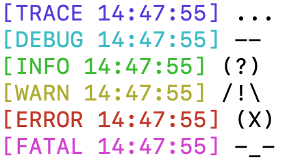

# lua-log

This logging module is inspired by [rxi](https://github.com/rxi).



## How to install?

`luarocks install log`

See [LuaRocks](http://luarocks.org/modules/mistrza/log) for versions.

## How to use?

```lua
-- Hello

log = require 'log'
log.output_file = 'log.txt'
log.usecolor = true -- Default

log.trace('Test')
log.info('Test')

```
